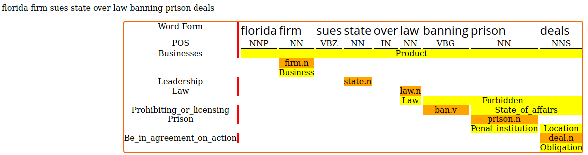

# ViewSESAME
Framework for visualization of CoNLL output from [OpenSESAME](https://github.com/swabhs/open-sesame)

## Requirements
- [Jinja2](https://jinja.palletsprojects.com/en/2.11.x/)
- Pandas


## Usage
```python main.py <EXAMPLE.conll>```
- `main.py` will produce `conllvis/EXAMPLE.html` and `conllvis/styles/EXAMPLE.CSS` as its output. `EXAMPLE.html` should be able to find its own corresponding CSS file.

## Sample Output:


## TODO
- Remove dependency on pandas and instead switch to the csv module for greater efficiency and general compatibility
